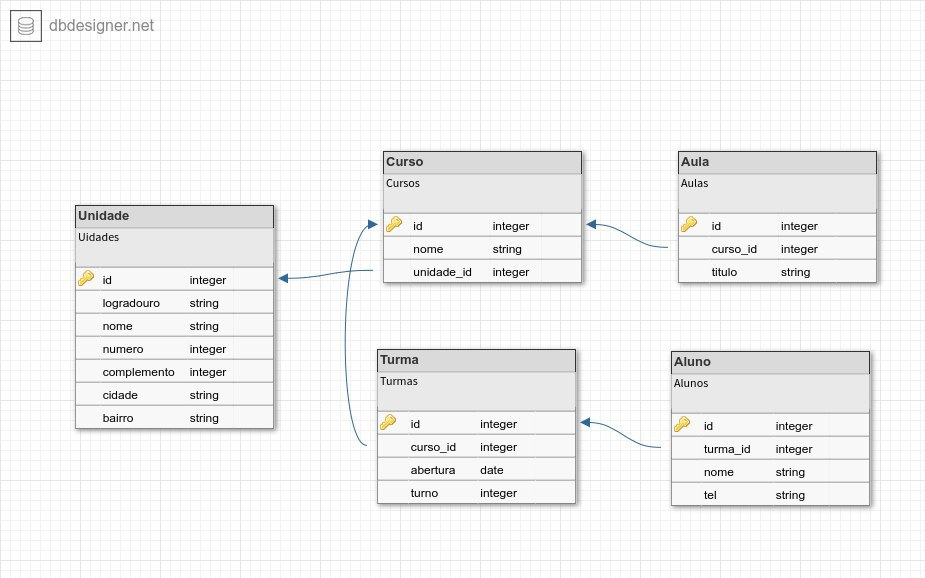

#  :open_file_folder: Acompanhamento Resilia

##  *Projeto Individual - Módulo 4*


### :white_circle: Proposta:

### *A Resilia está pensando em lançar um novo sistema de acompanhamento, e para isso precisa de ajuda para modelar um banco de dados que vai armazenar seus cursos, turmas e alunos.* 


#### Para apoiar neste sistema, foi realizado a seguinte modelagem para o banco de dados. Confira a modelagem, abaixo:



## Desenvolvimento:

### Criação da Tabela - Unidade

```sql
CREATE TABLE `Unidade` (
	`id` INT NOT NULL AUTO_INCREMENT,
	`logradouro` VARCHAR(255) NOT NULL,
	`nome` VARCHAR(255) NOT NULL,
	`numero` INT NOT NULL,
	`complemento` INT,
	`cidade` VARCHAR(255) NOT NULL,
	`bairro` VARCHAR(255) NOT NULL,
	PRIMARY KEY (`id`)
);
```
### Criação da Tabela - Curso

```sql
CREATE TABLE `Curso` (
	`id` INT NOT NULL AUTO_INCREMENT,
	`nome` VARCHAR(255) NOT NULL,
	`unidade_id` INT NOT NULL,
	PRIMARY KEY (`id`)
);
```
### Criação da Tabela - Turma

```sql
CREATE TABLE `Turma` (
	`id` INT NOT NULL AUTO_INCREMENT,
	`curso_id` INT NOT NULL,
	`abertura` DATE,
	`turno` INT,
	PRIMARY KEY (`id`)
);
```
### Criação da Tabela - Aluno

```sql
CREATE TABLE `Aluno` (
	`id` INT NOT NULL AUTO_INCREMENT,
	`turma_id` INT NOT NULL,
	`nome` VARCHAR(255) NOT NULL,
	`tel` VARCHAR(255),
	PRIMARY KEY (`id`)
);
```
### Criação da Tabela  - Aula

```sql
CREATE TABLE `Aula` (
	`id` INT NOT NULL AUTO_INCREMENT,
	`curso_id` INT NOT NULL,
	`titulo` VARCHAR(255) NOT NULL,
	PRIMARY KEY (`id`)
);
```
### Alteração das Tabelas - Criação dos Relacionamentos 

```sql
ALTER TABLE `Curso` ADD CONSTRAINT `Curso_fk0` FOREIGN KEY (`unidade_id`) REFERENCES `Unidade`(`id`);

ALTER TABLE `Turma` ADD CONSTRAINT `Turma_fk0` FOREIGN KEY (`curso_id`) REFERENCES `Curso`(`id`);

ALTER TABLE `Aluno` ADD CONSTRAINT `Aluno_fk0` FOREIGN KEY (`turma_id`) REFERENCES `Turma`(`id`);

ALTER TABLE `Aula` ADD CONSTRAINT `Aula_fk0` FOREIGN KEY (`curso_id`) REFERENCES `Curso`(`id`);
```
### Inserção dos Registros

```sql
INSERT iNTO Unidade (logradouro,nome,numero,complemento,cidade,bairro) 
VALUES ('Rua da Alfandega','SENAC CENTRO',10,null,'Rio De Janeiro','CENTRO');

INSERT iNTO Unidade (logradouro,nome,numero,complemento,cidade,bairro) 
VALUES ('Rua da Conceição','SENAC SANTA CRUZ',10,null,'Rio De Janeiro','SANTA CRUZ');

INSERT INTO Curso (nome,unidade_id) VALUES ('Desenvolvimento Web Full Stack',1);
INSERT INTO Curso (nome,unidade_id) VALUES ('Design Gráfico',2);

INSERT INTO Turma (curso_id,abertura,turno) VALUES (1,'2023-05-10',1);
INSERT INTO Turma (curso_id,abertura,turno) VALUES (2,'2023-07-10',2);

INSERT INTO Aluno (turma_id, nome, tel) VALUES (1,'Márcio Andrade da Cunha','21986589785');
INSERT INTO Aluno (turma_id, nome, tel) VALUES (2,'Aline Gomes da Silva','21987389944');

INSERT INTO Aula (curso_id,titulo) VALUES (1,'Banco de Dados');
INSERT INTO Aula (curso_id,titulo) VALUES (2,'Design para Mídias Sociais');
```

### Consultando as Tabelas

```sql
SELECT * FROM Unidade;
SELECT * FROM Curso;
SELECT * FROM Turma;
SELECT * FROM Aluno;
SELECT * FROM Aula;
```


### Informações e Perguntas

---

####  1. Existem outras entidades além dessas três?

> Um banco de dados inclui uma coleção de conjuntos de entidades, sendo algo particular,  e obviamente dependendo do mundo real que está sendo modelado."

*A proposta de um sistema de acompanhamento, como adicionado, poderia incluir também o conjuntos de entidades, **"unidades"** e **"Aulas"**. Entre outras, depende da percepção do mundo real, que consiste em desenvolver algo que facilite o projeto de um banco de dados permitindo a especificação de um esquema de uma empresa. A estrutura lógica geral da criação do banco de dados.*

---

####  2. Quais são os principais campos e tipos?

Os principais campos e tipos variam conforme a documentação/especificação do projeto a ser desenvolvido. Neste projeto em questão, foram criadas 4 tabelas (4 conjuntos de entidades) que se relacionam. 

**Os tipos de campos usados foram:**

* **INT** para *inteiros*;
* **VARCHAR** para *string*;
* **DATE** para *data*;

---

#### 3. Como essas entidades estão relacionadas?

**Relacionamento das entidades:**

* Unidade possui relacionamento **1:N** com Curso.
* Turma possui relacionamento  **N:1**  com Curso.
* Aluno possui relacionamento  **1:N** com Turma.
* Aula possui relacionamento **N:1** com Curso.


---
**Banco de Dados | Projeto Individual - Módulo 4
Prazo de Entrega: 10/02**
